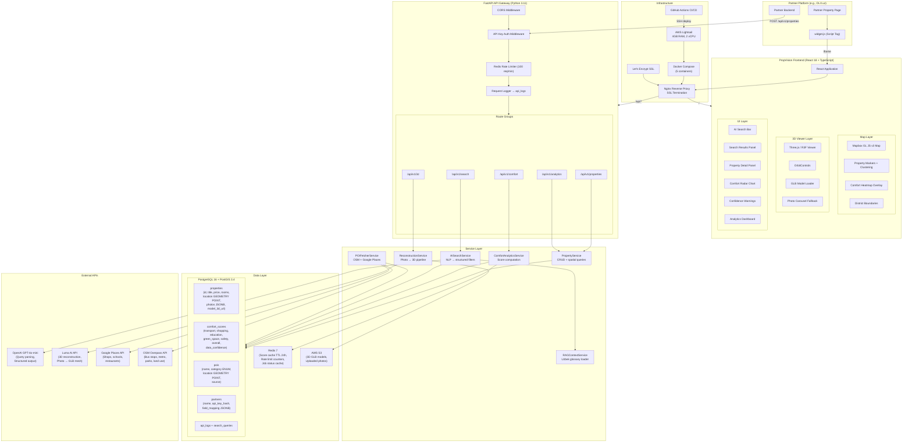
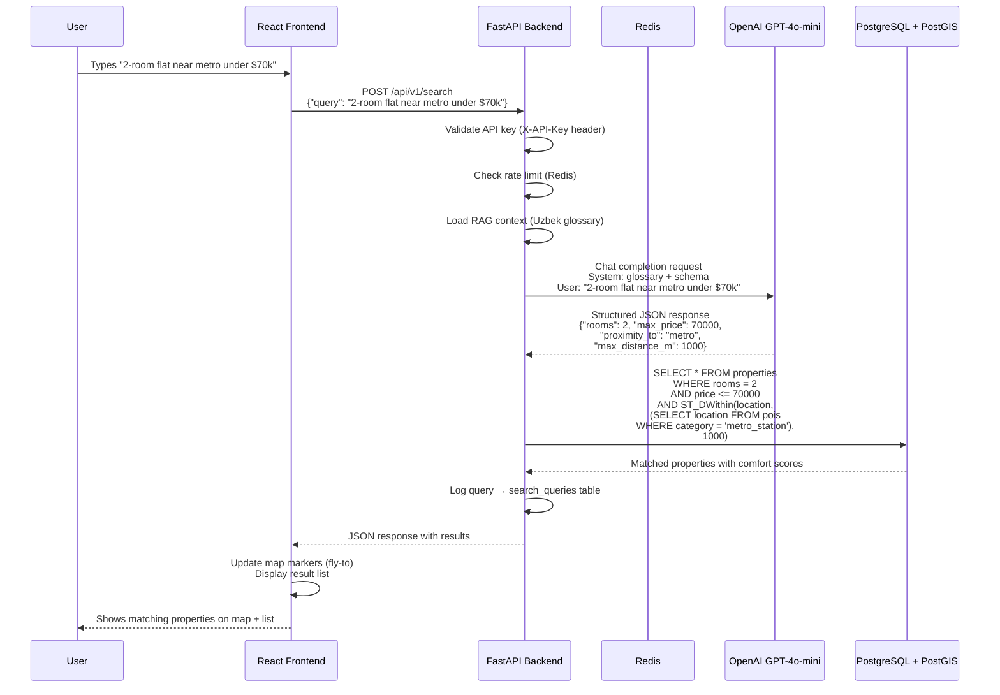
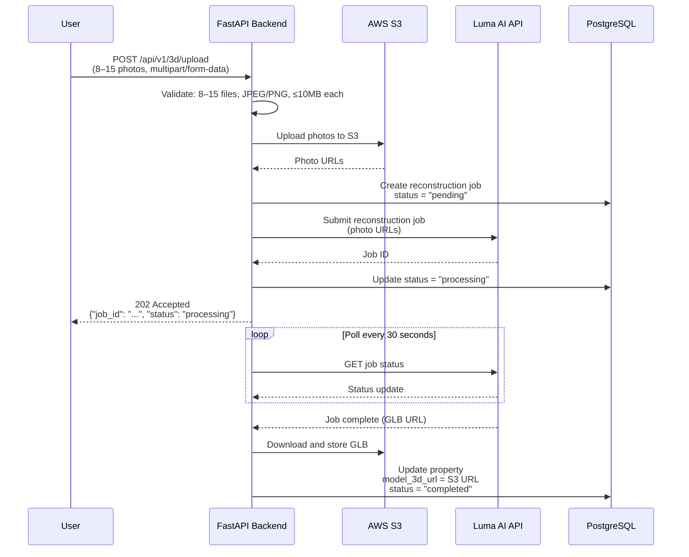

# Section 6 — System Architecture

## 6.1 Architecture Diagram



### Request Flow Diagrams

#### AI Search Flow


#### 3D Reconstruction Flow


---

## 6.2 Database Schema

### Complete PostgreSQL + PostGIS DDL

```sql
-- Enable required extensions
CREATE EXTENSION IF NOT EXISTS postgis;
CREATE EXTENSION IF NOT EXISTS pgcrypto;

-- ============================================================
-- ENUM TYPES
-- ============================================================

CREATE TYPE poi_category AS ENUM (
    'metro_station',
    'bus_stop',
    'taxi_stand',
    'supermarket',
    'convenience_store',
    'market',
    'school',
    'kindergarten',
    'university',
    'park',
    'garden',
    'recreation',
    'hospital',
    'police_station',
    'street_lamp',
    'restaurant'
);

CREATE TYPE poi_source AS ENUM ('osm', 'google_places');

CREATE TYPE data_confidence AS ENUM ('LOW', 'MEDIUM', 'HIGH');

CREATE TYPE reconstruction_status AS ENUM (
    'pending',
    'processing',
    'completed',
    'failed'
);

-- ============================================================
-- TABLES
-- ============================================================

-- Partners table
CREATE TABLE partners (
    id UUID PRIMARY KEY DEFAULT gen_random_uuid(),
    name VARCHAR(255) NOT NULL,
    api_key_hash VARCHAR(64) NOT NULL UNIQUE,  -- SHA-256 hash
    webhook_url VARCHAR(500),
    field_mapping JSONB DEFAULT '{}',
    is_active BOOLEAN DEFAULT TRUE,
    created_at TIMESTAMPTZ DEFAULT NOW(),
    updated_at TIMESTAMPTZ DEFAULT NOW()
);

CREATE INDEX idx_partners_api_key_hash ON partners(api_key_hash);

-- Properties table
CREATE TABLE properties (
    id UUID PRIMARY KEY DEFAULT gen_random_uuid(),
    title VARCHAR(500) NOT NULL,
    description TEXT,
    price NUMERIC(12, 2) NOT NULL,
    currency VARCHAR(3) DEFAULT 'USD',
    rooms INTEGER,
    area_sqm NUMERIC(8, 2),
    floor INTEGER,
    total_floors INTEGER,
    district VARCHAR(255),
    address VARCHAR(500),
    location GEOMETRY(POINT, 4326) NOT NULL,
    photos JSONB DEFAULT '[]',  -- Array of photo URLs
    model_3d_url VARCHAR(500),
    reconstruction_status reconstruction_status DEFAULT NULL,
    reconstruction_job_id VARCHAR(255),
    partner_id UUID REFERENCES partners(id) ON DELETE SET NULL,
    external_id VARCHAR(255),  -- Partner's property ID
    is_active BOOLEAN DEFAULT TRUE,
    created_at TIMESTAMPTZ DEFAULT NOW(),
    updated_at TIMESTAMPTZ DEFAULT NOW(),
    UNIQUE(partner_id, external_id)
);

-- Spatial index on property locations
CREATE INDEX idx_properties_location ON properties USING GIST (location);
-- B-tree indexes for common filter queries
CREATE INDEX idx_properties_district ON properties(district);
CREATE INDEX idx_properties_price ON properties(price);
CREATE INDEX idx_properties_rooms ON properties(rooms);
CREATE INDEX idx_properties_active ON properties(is_active) WHERE is_active = TRUE;
CREATE INDEX idx_properties_partner ON properties(partner_id);

-- Comfort scores table
CREATE TABLE comfort_scores (
    id UUID PRIMARY KEY DEFAULT gen_random_uuid(),
    property_id UUID NOT NULL REFERENCES properties(id) ON DELETE CASCADE,
    transport_score NUMERIC(5, 2) CHECK (transport_score BETWEEN 0 AND 100),
    shopping_score NUMERIC(5, 2) CHECK (shopping_score BETWEEN 0 AND 100),
    education_score NUMERIC(5, 2) CHECK (education_score BETWEEN 0 AND 100),
    green_space_score NUMERIC(5, 2) CHECK (green_score BETWEEN 0 AND 100),
    safety_score NUMERIC(5, 2) CHECK (safety_score BETWEEN 0 AND 100),
    overall_score NUMERIC(5, 2) CHECK (overall_score BETWEEN 0 AND 100),
    data_confidence data_confidence DEFAULT 'MEDIUM',
    raw_data JSONB DEFAULT '{}',  -- Raw computation data for debugging
    computed_at TIMESTAMPTZ DEFAULT NOW(),
    UNIQUE(property_id)
);

CREATE INDEX idx_comfort_property ON comfort_scores(property_id);
CREATE INDEX idx_comfort_overall ON comfort_scores(overall_score);

-- Points of Interest table
CREATE TABLE pois (
    id UUID PRIMARY KEY DEFAULT gen_random_uuid(),
    name VARCHAR(500),
    category poi_category NOT NULL,
    location GEOMETRY(POINT, 4326) NOT NULL,
    source poi_source NOT NULL,
    source_id VARCHAR(255),  -- OSM node ID or Google Place ID
    metadata JSONB DEFAULT '{}',  -- Additional source-specific data
    fetched_at TIMESTAMPTZ DEFAULT NOW()
);

-- Spatial index on POI locations
CREATE INDEX idx_pois_location ON pois USING GIST (location);
CREATE INDEX idx_pois_category ON pois(category);
CREATE INDEX idx_pois_source ON pois(source);
CREATE UNIQUE INDEX idx_pois_source_id ON pois(source, source_id) WHERE source_id IS NOT NULL;

-- API logs table
CREATE TABLE api_logs (
    id UUID PRIMARY KEY DEFAULT gen_random_uuid(),
    partner_id UUID REFERENCES partners(id) ON DELETE SET NULL,
    endpoint VARCHAR(255) NOT NULL,
    method VARCHAR(10) NOT NULL,
    status_code INTEGER NOT NULL,
    response_time_ms INTEGER,
    request_metadata JSONB DEFAULT '{}',
    created_at TIMESTAMPTZ DEFAULT NOW()
);

CREATE INDEX idx_api_logs_partner ON api_logs(partner_id);
CREATE INDEX idx_api_logs_created ON api_logs(created_at);
CREATE INDEX idx_api_logs_endpoint ON api_logs(endpoint);

-- Search queries table
CREATE TABLE search_queries (
    id UUID PRIMARY KEY DEFAULT gen_random_uuid(),
    raw_query TEXT NOT NULL,
    parsed_filters JSONB DEFAULT '{}',
    result_count INTEGER DEFAULT 0,
    parse_success BOOLEAN DEFAULT TRUE,
    processing_time_ms INTEGER,
    created_at TIMESTAMPTZ DEFAULT NOW()
);

CREATE INDEX idx_search_queries_created ON search_queries(created_at);

-- ============================================================
-- FUNCTIONS
-- ============================================================

-- Auto-update updated_at timestamp
CREATE OR REPLACE FUNCTION update_updated_at_column()
RETURNS TRIGGER AS $$
BEGIN
    NEW.updated_at = NOW();
    RETURN NEW;
END;
$$ language 'plpgsql';

CREATE TRIGGER update_properties_updated_at
    BEFORE UPDATE ON properties
    FOR EACH ROW EXECUTE FUNCTION update_updated_at_column();

CREATE TRIGGER update_partners_updated_at
    BEFORE UPDATE ON partners
    FOR EACH ROW EXECUTE FUNCTION update_updated_at_column();
```

### Entity Relationship Diagram

```mermaid
erDiagram
    PARTNERS ||--o{ PROPERTIES : "submits"
    PARTNERS ||--o{ API_LOGS : "generates"
    PROPERTIES ||--o| COMFORT_SCORES : "has"
    PROPERTIES }o--o{ POIS : "nearby (spatial)"

    PARTNERS {
        uuid id PK
        varchar name
        varchar api_key_hash UK
        varchar webhook_url
        jsonb field_mapping
        boolean is_active
        timestamptz created_at
        timestamptz updated_at
    }

    PROPERTIES {
        uuid id PK
        varchar title
        text description
        numeric price
        varchar currency
        integer rooms
        numeric area_sqm
        integer floor
        integer total_floors
        varchar district
        varchar address
        geometry location "POINT SRID 4326"
        jsonb photos
        varchar model_3d_url
        reconstruction_status recon_status
        uuid partner_id FK
        varchar external_id
        boolean is_active
        timestamptz created_at
        timestamptz updated_at
    }

    COMFORT_SCORES {
        uuid id PK
        uuid property_id FK UK
        numeric transport_score "0-100"
        numeric shopping_score "0-100"
        numeric education_score "0-100"
        numeric green_space_score "0-100"
        numeric safety_score "0-100"
        numeric overall_score "0-100"
        data_confidence confidence
        jsonb raw_data
        timestamptz computed_at
    }

    POIS {
        uuid id PK
        varchar name
        poi_category category
        geometry location "POINT SRID 4326"
        poi_source source
        varchar source_id
        jsonb metadata
        timestamptz fetched_at
    }

    API_LOGS {
        uuid id PK
        uuid partner_id FK
        varchar endpoint
        varchar method
        integer status_code
        integer response_time_ms
        jsonb request_metadata
        timestamptz created_at
    }

    SEARCH_QUERIES {
        uuid id PK
        text raw_query
        jsonb parsed_filters
        integer result_count
        boolean parse_success
        integer processing_time_ms
        timestamptz created_at
    }
```

---

## 6.3 API Specification

The complete OpenAPI 3.0 specification is available in [`openapi.yaml`](file:///Users/leofillium/Documents/GitHub/prop-vision-ai/openapi.yaml).

### Endpoint Summary

| Method | Endpoint | Description | Auth |
|--------|----------|-------------|------|
| `POST` | `/api/v1/properties` | Ingest property data from partner | API Key |
| `GET` | `/api/v1/properties` | List/filter properties (bbox, price, rooms, district) | API Key |
| `GET` | `/api/v1/properties/{id}` | Single property with comfort scores | API Key |
| `POST` | `/api/v1/search` | AI natural language search | API Key |
| `GET` | `/api/v1/comfort/{property_id}` | Comfort scores breakdown | API Key |
| `POST` | `/api/v1/3d/upload` | Upload photos for 3D reconstruction | API Key |
| `GET` | `/api/v1/3d/{property_id}/status` | Reconstruction job status | API Key |
| `GET` | `/api/v1/analytics/dashboard` | Engagement metrics (internal) | API Key |

### Authentication

All endpoints require an `X-API-Key` header:
```
X-API-Key: pv_live_a1b2c3d4e5f6g7h8i9j0
```

Keys are validated by hashing (SHA-256) and comparing against the `partners.api_key_hash` column.

### Error Response Format

All errors follow a consistent structure:
```json
{
    "detail": "Human-readable error message",
    "error_code": "MACHINE_READABLE_CODE",
    "status_code": 422
}
```

Standard HTTP status codes used: `200`, `201`, `202`, `400`, `401`, `404`, `422`, `429`, `500`.
