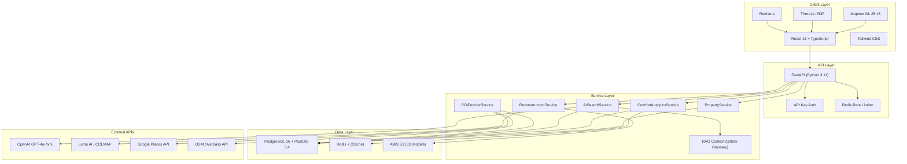

# Section 5 — Methodology, Approach & Resources

## 5.1 Research Methodology

### Secondary Data (MVP Phase)

The MVP phase relies on publicly available secondary data sources to establish market context, validate the problem statement, and inform technical decisions.

| Data Category | Sources | Purpose |
|--------------|---------|---------|
| Market sizing | Central Bank of Uzbekistan real estate reports (2025), World Bank Uzbekistan economic indicators, Uzbekistan State Statistics Committee housing data | Quantify the real estate market opportunity: transaction volumes (319,500 in 2025), growth rates (+15.8% YoY), mortgage penetration (22% of transactions) |
| Competitive landscape | Direct analysis of OLX.uz, Uysot.uz, Birbir.uz — feature audits, UX teardowns, listing formats, search capabilities, pricing models | Identify specific feature gaps that PropVision.AI addresses: no 3D, no AI search, no neighborhood analytics |
| International benchmarks | Zillow 3D Home (US), Matterport (global), Rightmove (UK), Domain.com.au (Australia) — feature comparisons, user engagement metrics | Benchmark what best-in-class platforms offer and how PropVision's B2B model compares |
| Technology assessment | OpenAI API documentation, Mapbox GL JS examples, Three.js documentation, PostGIS documentation, Luma AI/COLMAP comparisons | Validate technical feasibility and inform architecture decisions |
| Proptech industry trends | CB Insights proptech reports, Crunchbase Uzbekistan tech startup data, TechCrunch Central Asia coverage | Understand investor interest, competitive dynamics, and market maturation timeline |

### Primary Data (Post-MVP Phase)

Post-MVP validation involves structured primary research with three target segments:

| Segment | Sample Size | Method | Focus Areas |
|---------|-------------|--------|-------------|
| Real estate agents | 5–8 participants | Semi-structured interviews (60 min each) + MVP demo session | Pain points with current listing tools, interest in 3D/comfort features, willingness to recommend to agencies/platforms, pricing sensitivity |
| Platform product managers | 3–5 participants | Structured interviews (45 min each) + technical integration walkthrough | Integration complexity assessment, feature prioritization for their platform, data sharing concerns, partnership deal structure preferences |
| Property buyers/renters | 8–12 participants | Moderated usability testing (45 min each) + post-session survey | Task completion rates (search, 3D view, interpret comfort scores), time-on-task, comprehension of comfort analytics, overall satisfaction (Likert scale), feature preference ranking |

**Usability testing protocol:**
1. Task 1: Use AI search to find a specific type of property (e.g., "Find a 2-room apartment in Yunusabad under $60,000")
2. Task 2: View the 3D model of a property and describe the room layout
3. Task 3: Compare comfort scores of two properties and explain which has better transport access
4. Task 4: Imagine you're a real estate platform — embed the widget on a dummy page using the integration guide
5. Task 5: Navigate the analytics dashboard and identify which district has the highest average comfort score

---

## 5.2 Analytical Frameworks

### SWOT Analysis

*(Full analysis provided in Section 9: docs/ANALYTICAL_FRAMEWORKS.md)*

### Porter's Five Forces

*(Full analysis provided in Section 9: docs/ANALYTICAL_FRAMEWORKS.md)*

### PESTEL Analysis

*(Full analysis provided in Section 9: docs/ANALYTICAL_FRAMEWORKS.md)*

---

## 5.3 Development Methodology

### Agile Scrum Framework

| Parameter | Configuration |
|-----------|--------------|
| Sprint duration | 2 weeks (10 working days) |
| Sprint ceremonies | Sprint Planning (2h, Day 1), Daily Standup (15 min, async written for solo developer), Sprint Review (1h, last day), Sprint Retrospective (30 min, last day) |
| Backlog management | Jira with Product Backlog, Sprint Backlog, and Done columns |
| Documentation | Confluence space with: Architecture, API Docs, Meeting Notes, Decision Log |
| Version control | GitHub with branch protection on `main` ← `develop` ← `feature/*` branches |
| Code review | Required for all PRs to `develop` and `main`. Self-review checklist for solo development, peer review when collaborators are available |
| Definition of Ready | User story has acceptance criteria, technical approach identified, dependencies resolved, estimation completed |
| Definition of Done | Code complete, unit tests pass, integration tests pass (if applicable), code reviewed, documentation updated, no known regressions |

### Sprint Plan (10 Sprints × 2 Weeks = 100 Working Days)

| Sprint | Days | Focus | Key Deliverables |
|--------|------|-------|-----------------|
| Sprint 1 | 1–10 | Environment + Foundation | Dev environment, Docker Compose, project structure, Jira/Confluence setup |
| Sprint 2 | 11–20 | Design + API Architecture | Figma designs, OpenAPI spec, database schema, Alembic migrations |
| Sprint 3 | 21–30 | Backend Core (Properties + POI) | Property CRUD, POI fetcher, comfort score computation |
| Sprint 4 | 31–40 | Backend Core (AI + Auth) | AI search service, RAG glossary, API key auth, rate limiting, analytics |
| Sprint 5 | 41–50 | Frontend Map + Property | MapView, PropertyPanel, photo gallery, Three.js viewer |
| Sprint 6 | 51–55 | Frontend Search + Comfort | AI search bar, search results, comfort radar chart, heatmap overlay |
| Sprint 7 | 56–65 | 3D Pipeline | Photo upload, Luma AI integration, GLB processing, 5 demo models |
| Sprint 8 | 66–75 | Integration + Widget | Embeddable widget, data ingestion, integration guide, analytics dashboard |
| Sprint 9 | 76–88 | Data + Testing + QA | Seed 30 properties, compute scores, E2E testing, performance testing, bug fixes |
| Sprint 10 | 89–100 | Deploy + User Testing | AWS deployment, SSL, CI/CD, user testing, feedback report |

---

## 5.4 Technology Stack (Definitive)

| Layer | Technology | Version | Justification |
|-------|-----------|---------|---------------|
| **Frontend Framework** | React | 18.x | Component-based architecture, largest ecosystem, excellent for map/3D integrations. TypeScript support is first-class. Virtual DOM ensures efficient re-renders for map marker and panel updates. |
| **Frontend Language** | TypeScript | 5.x | Static typing prevents runtime errors common in complex geospatial applications. Interface definitions document data shapes flowing between API and UI. Excellent IDE support (VSCode IntelliSense). |
| **UI Framework** | Tailwind CSS + Headless UI | 3.x + 2.x | Tailwind enables rapid, consistent styling with utility classes — critical for a solo developer maintaining visual consistency across 15+ components. Headless UI provides accessible, unstyled primitives (modals, dropdowns) that work with Tailwind. |
| **Build Tool** | Vite | 5.x | Sub-second hot module replacement (HMR) vs. Webpack's multi-second rebuilds. Native ESM support. Optimized production builds with Rollup. First-class TypeScript support without configuration. |
| **Mapping** | Mapbox GL JS | 3.x | Best-in-class web mapping: native 3D terrain, building extrusions, custom layers via WebGL, smooth animations (fly-to, ease-to). Free tier: 50K map loads/month — sufficient for MVP. Superior to Google Maps for custom styling and 3D capabilities. |
| **3D Rendering** | Three.js + @react-three/fiber + @react-three/drei | r160+ / 8.x / 9.x | Industry standard for WebGL rendering. R3F provides React integration with declarative 3D scene composition. Drei provides common utilities (OrbitControls, Environment, useGLTF loader). GLB/glTF support is native and optimized. |
| **Charts** | Recharts | 2.x | React-native charting library built on D3. Supports radar charts (for comfort scores), line charts (API calls over time), and bar charts (district scores). Simpler API than D3 directly, sufficient for MVP dashboard needs. |
| **Backend Framework** | FastAPI | 0.110+ | Async by default (built on Starlette + Uvicorn). Auto-generated OpenAPI documentation at `/docs`. Pydantic v2 integration for request validation. Native `async/await` for concurrent API calls (OpenAI, Google Places, Luma AI). Python ecosystem has the best AI/ML and geospatial libraries. |
| **Backend Language** | Python | 3.11 | Async performance improvements in 3.11 (10–60% faster than 3.10). `asyncio` task groups for concurrent external API calls. Extensive geospatial library ecosystem (GeoAlchemy2, Shapely, GeoPandas). |
| **Database** | PostgreSQL + PostGIS | 16 + 3.4 | PostgreSQL: mature, ACID-compliant, excellent JSON support. PostGIS: industry-standard spatial extension. Spatial functions used: `ST_DWithin` (proximity queries), `ST_Distance` (nearest neighbor), `ST_MakePoint` (coordinate creation), spatial indexes (GiST) for sub-millisecond geo-queries on 30 properties (scales to 100K+). |
| **ORM** | SQLAlchemy + GeoAlchemy2 | 2.0+ / 0.14+ | SQLAlchemy 2.0's async support (`async_sessionmaker`, `AsyncSession`) enables non-blocking database queries. GeoAlchemy2 maps PostGIS geometry types to Python objects. Alembic (from SQLAlchemy ecosystem) handles database migrations. |
| **Cache** | Redis | 7.x | Used for: (a) comfort score caching (TTL 24h, avoids recomputation on every property view), (b) API rate limiting (sliding window counter per API key), (c) 3D reconstruction job status caching (fast status lookups during polling). Persistence disabled — cache is ephemeral and can be rebuilt from the database. |
| **AI/NLP** | OpenAI API (GPT-4o-mini) | Latest | Best cost/performance ratio for structured output generation. GPT-4o-mini: ~$0.15/1M input tokens, ~$0.60/1M output tokens. `strict: true` structured outputs guarantee JSON schema compliance. No infrastructure to manage — pure API call. |
| **RAG Context** | In-memory JSON glossary | N/A | A JSON file (`uzbek_realestate_glossary.json`) containing 200+ Uzbek real estate terms is loaded at startup and injected into every AI search system prompt. This provides domain-specific context without fine-tuning. Zero infrastructure cost. |
| **3D Reconstruction** | Luma AI API (primary) / COLMAP (fallback) | Latest / 3.9 | Luma AI: cloud-based, no GPU required on our server, fast processing. COLMAP: open-source photogrammetry, self-hosted, requires GPU for performance but works on CPU (slower). Both produce GLB/glTF output compatible with Three.js. |
| **3D File Format** | GLB (binary glTF) | 2.0 | Binary variant of glTF — compact (no separate texture files), web-optimized (single HTTP request to fetch), natively supported by Three.js and all major 3D web frameworks. Target size: ≤ 10 MB per property model. |
| **Object Storage** | AWS Lightsail Object Storage | N/A | S3-compatible API for storing 3D GLB models and processed images. 250 GB included in Lightsail plan. Accessible via standard AWS SDK. |
| **Containerization** | Docker + Docker Compose | 24.x / 2.x | Reproducible environments across development and production. Docker Compose orchestrates all 5 services with a single `docker-compose up`. Health checks, restart policies, and volume management configured declaratively. |
| **Hosting** | AWS Lightsail | N/A | Predictable pricing ($40/month for 4 GB instance). Includes static IP, DNS management, firewall rules, and snapshot backups. Simpler than EC2 for MVP-stage projects. Clear upgrade path to EC2/ECS when scaling is needed. |
| **SSL** | Let's Encrypt (Certbot) | Latest | Free, automated HTTPS certificates. 90-day validity with auto-renewal via cron. Industry standard for non-enterprise SSL. |
| **CI/CD** | GitHub Actions | N/A | Free for public repositories (2,000 minutes/month for private). Native GitHub integration — no external CI server to manage. Supports matrix builds, secret management, and SSH deployment steps. |
| **Design** | Figma | N/A | Industry standard for UI/UX design. Component library, auto-layout, prototyping, and developer handoff. Free tier sufficient for MVP (3 Figma files, unlimited personal projects). |
| **Project Management** | Jira + Confluence | Cloud (Free) | Jira: sprint planning, backlog management, burn-down charts. Confluence: technical documentation, meeting notes, decision log. Free tier supports up to 10 users — sufficient for solo or small team development. |

### Technology Stack Diagram

