# Section 8 — Project Plan (100 Working Days)

**Total Duration:** 100 working days (20 weeks / 5 months)  
**Sprint Length:** 2 weeks (10 working days)  
**Total Sprints:** 10

---

## Phase 1 — Environment Setup & Foundation (Days 1–10)

| Day | Tasks | Deliverables |
|-----|-------|-------------|
| **Day 1** | Set up GitHub repository. Create `.gitignore`, `LICENSE`, `README.md`. Configure branch strategy: `main` ← `develop` ← `feature/*`. Create PR template. | GitHub repo with branch protection rules |
| **Day 2** | Set up GitHub Actions CI pipeline: lint (flake8, black --check for Python; eslint, tsc --noEmit for TypeScript), test (pytest), on PR to develop/main. | `.github/workflows/ci.yml` running on all PRs |
| **Day 3** | Create Docker Compose configuration: FastAPI (Dockerfile), PostgreSQL 16 + PostGIS 3.4, Redis 7, Nginx. Write all Dockerfiles. | `docker-compose.yml`, `backend/Dockerfile`, `frontend/Dockerfile`, `infra/nginx/default.conf` |
| **Day 4** | Verify Docker Compose: all containers start, inter-service networking (API → PostgreSQL, API → Redis, Nginx → API, Nginx → Frontend). Write health check endpoints. | All 5 containers running with `docker-compose up`. Health check at `/api/v1/health` returns 200. |
| **Day 5** | Initialize FastAPI project structure: folders (`app/`, `app/models/`, `app/schemas/`, `app/api/routes/`, `app/services/`), `config.py` (Pydantic BaseSettings), `database.py` (async SQLAlchemy engine). | Structured backend codebase with configuration management |
| **Day 6** | Set up Alembic for database migrations. Create initial migration with PostGIS extension and all tables (properties, comfort_scores, pois, partners, api_logs, search_queries). Run migration against Docker PostgreSQL. | `alembic/` directory with initial migration. Database schema deployed to dev PostgreSQL. |
| **Day 7** | Initialize React + TypeScript project with Vite. `npx create-vite@latest --template react-ts`. Configure Tailwind CSS, ESLint, Prettier. | Frontend project structure with Vite dev server running |
| **Day 8** | Set up React Router, Axios client with API key interceptor, basic folder structure (`types/`, `api/`, `components/`, `hooks/`, `utils/`). Create configuration module (`config.ts`) for API URLs and Mapbox token. | Frontend project structure complete with routing and API client |
| **Day 9** | Set up Jira board: create project, define epics (Map Viewer, AI Search, Comfort Analytics, 3D Pipeline, Integration, Deployment). Populate backlog with user stories from scope document. Sprint 1 planning. Set up Confluence space with project documentation template. | Jira board with populated backlog. Confluence space with documentation templates. |
| **Day 10** | Set up Figma project. Create component library: color palette (brand colors, semantic colors), typography scale (Inter font, 6 sizes), spacing tokens (4px grid), component variants (buttons, inputs, cards, badges). | Figma design system with core tokens and reusable components |

**Phase 1 Deliverable:** Running local dev environment with all services containerized. Empty but structured codebases for frontend and backend. Jira board populated. Figma component library ready.

---

## Phase 2 — UI/UX Design & API Architecture (Days 11–20)

| Day | Tasks | Deliverables |
|-----|-------|-------------|
| **Day 11** | Design main map view screen in Figma: full-screen map with sidebar panel, property markers, AI search bar at top, district selector. | Figma frame: Map View (desktop + mobile) |
| **Day 12** | Design property detail panel in Figma: photo gallery/carousel, price/rooms/area info, comfort radar chart, 3D model viewer placeholder, "Contact Seller" CTA. | Figma frame: Property Detail Panel |
| **Day 13** | Design AI search bar + results in Figma: search input with placeholder examples, loading state, result cards with thumbnails and key metrics, "no results" state, error state. Design comfort analytics panel with radar chart, individual score bars, confidence indicators. | Figma frames: Search Bar, Search Results, Comfort Panel |
| **Day 14** | Design embeddable widget layout in Figma: compact widget view (comfort scores + mini 3D viewer), expanded widget view (full detail panel), light and dark theme variants. | Figma frames: Widget layouts (compact/expanded, light/dark) |
| **Day 15** | Design partner dashboard mockup in Figma: API key display panel, theme configuration, field mapping table, usage statistics summary. Design analytics dashboard: API calls line chart, top queries table, district comfort bar chart. | Figma frames: Partner Dashboard Mockup, Analytics Dashboard |
| **Day 16** | Define complete REST API specification: write `openapi.yaml` with all 8 endpoints, define request/response schemas, document error codes, authentication mechanism, rate limiting headers. | Complete `openapi.yaml` (OpenAPI 3.0) |
| **Day 17** | Review and refine API specification: add request/response examples for each endpoint, document query parameters, pagination format, sorting options. Write API_DOCUMENTATION.md with endpoint reference. | Finalized `openapi.yaml` + `docs/API_DOCUMENTATION.md` |
| **Day 18** | Design and finalize database schema SQL. Create all Alembic migration files. Include indexes, constraints, triggers (updated_at auto-update). | `alembic/versions/001_initial_schema.py` |
| **Day 19** | Run migration against PostgreSQL. Verify all tables, indexes, and constraints are created correctly. Test spatial index with a sample INSERT + spatial query. | Database schema deployed and verified |
| **Day 20** | Architecture review: verify Figma designs are consistent with API spec and database schema (same field names, same data types). Document architecture decisions in `ARCHITECTURE_DECISION_RECORDS.md`. Update Confluence. | Consistency review passed. Architecture documentation complete. |

**Phase 2 Deliverable:** Complete Figma designs (all screens). Finalized OpenAPI spec. Database schema deployed to dev PostgreSQL. Architecture documentation complete.

---

## Phase 3 — Backend Core Development (Days 21–40)

| Day | Tasks | Deliverables |
|-----|-------|-------------|
| **Day 21–22** | Implement Property SQLAlchemy models with GeoAlchemy2 (`Property`, `ComfortScore`, `POI`, `Partner`, `ApiLog`, `SearchQuery`). Implement Pydantic v2 schemas for request/response validation with WKB→GeoJSON serialization. | All models and schemas in `app/models/` and `app/schemas/` |
| **Day 23** | Implement PropertyService with CRUD operations: create property (with spatial point creation from lat/lng), list properties with filtering (district, price range, rooms, bounding box via PostGIS), get single property with comfort scores. Unit tests for each method. | `app/services/property_service.py` + `tests/test_api.py` (property endpoints) |
| **Day 24–25** | Implement property CRUD API routes: `POST /api/v1/properties`, `GET /api/v1/properties` (with query parameters for filtering), `GET /api/v1/properties/{id}`. Connect routes to PropertyService. Integration tests. | `app/api/routes/properties.py` + working Swagger UI |
| **Day 26–27** | Implement POI fetcher service: OSM Overpass API integration (build Overpass QL queries for bus stops, metro stations, parks, schools, hospitals, police stations, street lamps within a Tashkent bounding box). Google Places API integration (nearby search for supermarkets, restaurants, kindergartens, universities). Store results in `pois` table with deduplication. | `app/services/poi_fetcher.py` + `scripts/fetch_pois.py` |
| **Day 28–29** | Implement comfort analytics computation service: PostGIS queries using `ST_DWithin` to find POIs within scoring radius for each property. Score computation logic: count density + nearest distance for each category. Configurable weight factors. Confidence level calculation (based on data point count). Unit tests with mock POI data. | `app/services/comfort_service.py` + `tests/test_comfort.py` |
| **Day 30** | Implement comfort API route: `GET /api/v1/comfort/{property_id}`. Redis caching for comfort scores (TTL 24h). Connect to ComfortAnalyticsService. | `app/api/routes/comfort.py` + Redis caching |
| **Day 31–32** | Build Uzbek real estate RAG glossary JSON file: 200+ terms covering room types, property types, districts, landmarks, price terminology, amenities — in Uzbek, Russian, and English with translations and usage examples. Implement RAG context loader service. | `app/data/uzbek_realestate_glossary.json` + `app/services/rag_context.py` |
| **Day 33–34** | Implement AI search service: OpenAI GPT-4o-mini integration with structured output (`strict: true`). System prompt engineering: include glossary, define output schema (Pydantic model), include 5 few-shot examples. Parse structured output into PostGIS query filters. Execute spatial query combining price/rooms filters with `ST_DWithin` proximity queries. Return ranked results. | `app/services/ai_search_service.py` |
| **Day 35–36** | Build 50 test queries (20 English, 20 Russian, 10 Uzbek/mixed) with expected parsed filter outputs. Run automated accuracy testing. Iterate on system prompt to achieve ≥85% accuracy. | `tests/test_search.py` with 50 test cases, accuracy ≥85% |
| **Day 37** | Implement AI search API route: `POST /api/v1/search`. Log queries to `search_queries` table. Error handling for OpenAI API failures (timeout, rate limit, invalid response). | `app/api/routes/search.py` |
| **Day 38** | Implement API key authentication middleware: extract `X-API-Key` header, hash with SHA-256, lookup in `partners` table. Return 401 for invalid keys. Implement request logging middleware: record endpoint, method, status code, response time to `api_logs` table. | `app/api/dependencies.py` + `app/api/middleware.py` |
| **Day 39** | Implement rate limiting via Redis: sliding window counter per API key, 100 requests/minute limit. Return 429 with `Retry-After` header when exceeded. | Rate limiting integrated into middleware |
| **Day 40** | Implement analytics endpoints: `GET /api/v1/analytics/dashboard` returning daily API call counts (last 30 days), top 10 search queries, average comfort scores by district, 3D model view count. Integration tests for all endpoints. | `app/api/routes/analytics.py` + full integration test suite |

**Phase 3 Deliverable:** Fully functional backend API. All endpoints tested. Swagger UI accessible at `/docs`. ≥85% AI search accuracy.

---

## Phase 4 — Frontend Map & Property Viewer (Days 41–55)

| Day | Tasks | Deliverables |
|-----|-------|-------------|
| **Day 41–42** | Implement MapView component: initialize Mapbox GL JS, configure map style (dark mode variant), add 3D building extrusions, set initial viewport to Tashkent center (41.2995°N, 69.2401°E). Add zoom/pan/tilt controls. | `src/components/Map/MapView.tsx` |
| **Day 43–44** | Add property markers to map: custom marker component with property photo thumbnail, price badge. Implement marker clustering (Mapbox supercluster). Click handler: fly-to animation on marker click, open PropertyPanel. District boundary overlays with toggle. | `src/components/Map/PropertyMarker.tsx` + clustering logic |
| **Day 45–46** | Implement PropertyPanel: side panel slide-in animation, photo gallery (responsive carousel with CSS transitions, swipe support), property details display (price, rooms, area, address, floor). | `src/components/Property/PropertyPanel.tsx` + `PhotoGallery.tsx` |
| **Day 47–48** | Implement comfort scores display in PropertyPanel: Recharts radar chart (5-axis: transport, shopping, education, green space, safety), individual score badges with color coding (green ≥70, yellow 40–69, red <40), confidence warning component. | `src/components/Comfort/ComfortRadar.tsx` + `ScoreBadge.tsx` + `ConfidenceWarning.tsx` |
| **Day 49–50** | Implement Three.js 3D viewer: `@react-three/fiber` canvas, `useGLTF` for GLB loading, `OrbitControls` (rotate/zoom/pan), auto-rotation toggle button, fullscreen mode (Fullscreen API), loading progress bar. Fallback: if no 3D model, show photo carousel. | `src/components/Property/ThreeViewer.tsx` |
| **Day 51–52** | Implement AI search bar: search input with placeholder examples, debounced input (300ms), loading spinner during API call. Implement search results: scrollable result cards with photo thumbnail, price, rooms, district, comfort score badge. Click result → map fly-to + open PropertyPanel. | `src/components/Search/AISearchBar.tsx` + `SearchResults.tsx` |
| **Day 53–54** | Implement comfort heatmap overlay on map: use Mapbox `heatmap` layer type, colored by overall comfort score (green = high, yellow = medium, red = low). Toggle button to show/hide heatmap. | `src/components/Map/ComfortOverlay.tsx` |
| **Day 55** | Connect all frontend components to backend API: implement React Query hooks (`useProperties`, `useSearch`, `useComfort`), configure Axios client with API key header, handle loading/error/empty states for all data-dependent components. | `src/hooks/` + `src/api/` fully connected |

**Phase 4 Deliverable:** Complete frontend with map, property viewer, 3D models, AI search, and comfort analytics. Connected to backend API.

---

## Phase 5 — 3D Reconstruction Pipeline (Days 56–65)

| Day | Tasks | Deliverables |
|-----|-------|-------------|
| **Day 56–57** | Implement photo upload endpoint: `POST /api/v1/3d/upload`. Multi-file upload validation (8–15 images, JPEG/PNG only, max 10 MB each). Store originals in S3-compatible object storage. Create reconstruction job record in database. | `app/api/routes/reconstruction.py` (upload endpoint) |
| **Day 58–59** | Implement Luma AI API integration in ReconstructionService: submit reconstruction job (photo URLs), poll for status (background task), download GLB result on completion. Error handling for failed jobs. | `app/services/reconstruction_service.py` |
| **Day 60–61** | Implement job status endpoint: `GET /api/v1/3d/{property_id}/status`. Return status (pending/processing/completed/failed), progress percentage (if available), estimated time remaining, download URL (on completion). | `app/api/routes/reconstruction.py` (status endpoint) |
| **Day 62–63** | Process 5 demo properties through the pipeline. Prepare photos (8–15 per property, taken from real Tashkent apartment listings or stock photos). Upload, process, store resulting GLB files. | 5 GLB files stored in S3, linked to property records |
| **Day 64–65** | Test 3D viewer with real reconstructed models. Verify: model loads correctly in Three.js viewer, orbit controls work, textures display. Optimize GLB file sizes: apply Draco compression or mesh decimation if any model exceeds 10 MB. Document photo requirements for sellers. | All 5 models viewable in browser. File sizes ≤ 10 MB each. |

**Phase 5 Deliverable:** Working photo-to-3D pipeline. 5 demo properties with 3D models viewable in browser.

---

## Phase 6 — Integration Layer & Widget (Days 66–75)

| Day | Tasks | Deliverables |
|-----|-------|-------------|
| **Day 66–67** | Build embeddable `widget.js`: self-executing JavaScript that reads data attributes from container `
`, creates iframe pointing to PropVision frontend with property detail view. Responsive sizing (fills container width). Cross-origin `postMessage` for bidirectional communication. | `public/widget.js` |
| **Day 68** | Implement widget theme support: light/dark mode via `data-theme` attribute. Style iframe content to match Tailwind design system. Test on a dummy HTML page simulating a partner site. | Widget rendering correctly in both themes |
| **Day 69–70** | Build data ingestion API with dynamic field mapping: enhance `POST /api/v1/properties` to accept partner-specific field names, map using `field_mapping` JSONB from `partners` table. Implement partner registration (admin-only endpoint or script). | Flexible data ingestion with per-partner field mapping |
| **Day 71–72** | Write integration documentation: `INTEGRATION_GUIDE.md` with step-by-step instructions, code examples in JavaScript, Python, and cURL. Include: getting an API key, pushing property data, embedding the widget, configuring field mapping. | Complete `docs/INTEGRATION_GUIDE.md` |
| **Day 73–74** | Build analytics dashboard page: `DashboardPage.tsx` with Recharts line chart (daily API calls), table (top 10 queries), bar chart (comfort scores by district), counter (3D model views). Connect to `GET /api/v1/analytics/dashboard`. | `src/components/Dashboard/` fully functional |
| **Day 75** | End-to-end integration test: simulate a partner pushing data via API → data appears on map → search returns it → comfort scores display → widget renders it on an external page. | Full integration flow verified |

**Phase 6 Deliverable:** Embeddable widget ready for partner testing. Integration documentation complete. Analytics dashboard functional.

---

## Phase 7 — Demo Data, Testing & QA (Days 76–88)

| Day | Tasks | Deliverables |
|-----|-------|-------------|
| **Day 76–77** | Seed 30 demo properties with realistic Tashkent data: properties across 6 districts (Yunusabad, Mirzo Ulugbek, Chilanzar, Sergeli, Shaykhantakhur, Yakkasaray). Realistic prices ($25,000–$200,000), room counts (1–5), areas (30–150 m²). Descriptions in Russian and English. | `scripts/seed_demo_data.py` + 30 properties in database |
| **Day 78** | Fetch POIs for all property locations using the POI fetcher script. Verify POI coverage across all 6 districts. | `scripts/fetch_pois.py` executed, 500+ POIs in database |
| **Day 79–80** | Compute comfort scores for all 30 properties. Manual verification: do high-transport-score properties actually appear near metro stations on the map? Do high-green-space-score properties have parks nearby? Fix any scoring anomalies. | All 30 properties have verified comfort scores |
| **Day 81–82** | End-to-end testing: complete user flow testing for all primary scenarios (property search, AI query, comfort views, 3D model loading, widget embedding). Document test cases and results. | Test report document with pass/fail for all scenarios |
| **Day 83–84** | Cross-browser testing: Chrome (latest), Firefox (latest), Safari (latest), Edge (latest). Test on mobile viewport sizes (375px, 390px, 414px). Verify 3D viewer, map interactions, and search functionality. | Cross-browser compatibility matrix (all green) |
| **Day 85–86** | Performance testing: API response times (target: p95 < 500ms for search, < 200ms for property detail). Frontend load time (target: < 3 seconds on throttled 4G connection). Lighthouse audit (target: performance > 70). Fix any performance regressions. | Performance test report meeting all targets |
| **Day 87–88** | Bug fixes and UI polish: responsive design verification on all breakpoints, error state handling (no results, API timeout, 3D model load failure, network error). Loading skeleton animations for all async content. Final visual polish pass. | All bugs resolved. UI polished and responsive. |

**Phase 7 Deliverable:** Fully tested MVP with 30 demo properties, 5 with 3D models. All bugs resolved.

---

## Phase 8 — Deployment & Launch (Days 89–95)

| Day | Tasks | Deliverables |
|-----|-------|-------------|
| **Day 89** | Provision AWS Lightsail instance (4 GB, 2 vCPU, 80 GB SSD, Ubuntu 22.04). Configure static IP, DNS A record. Install Docker and Docker Compose on the instance. | Lightsail instance running with Docker |
| **Day 90** | Deploy Docker Compose stack to Lightsail: push production Docker images, pull on server, start all containers. Verify all services start correctly and communicate. | All 5 containers running on production server |
| **Day 91** | Configure SSL with Let's Encrypt: run Certbot, configure Nginx for HTTPS, set up HTTP→HTTPS redirect. Set up Certbot auto-renewal cron job (twice daily). | HTTPS working for frontend and API |
| **Day 92** | Set up production cron jobs: nightly comfort score recomputation (01:00 UTC), weekly POI data refresh (Sunday 03:00 UTC). Configure log rotation for container logs. | Cron jobs scheduled and tested |
| **Day 93** | Configure GitHub Actions deployment pipeline: push to `main` triggers SSH into Lightsail → `docker-compose pull && docker-compose up -d`. Store SSH key and server IP in GitHub Secrets. | Automated deployment on push to main |
| **Day 94** | Production smoke testing: verify all API endpoints, all UI flows, widget embedding on a dummy HTML page, 3D model loading, AI search. Verify SSL certificate. Check API response times. | All smoke tests passing on production |
| **Day 95** | Write deployment runbook: document how to deploy, rollback (snapshot restore), monitor logs (`docker-compose logs`), restart services, add new partner API keys. Store in Confluence. | `infra/README.md` + Confluence deployment runbook |

**Phase 8 Deliverable:** Live MVP accessible at configured domain. Automated deployment pipeline.

---

## Phase 9 — User Testing & Feedback (Days 96–100)

| Day | Tasks | Deliverables |
|-----|-------|-------------|
| **Day 96** | Prepare UX testing materials: task script (5 tasks as defined in Section 5.1), Google Form questionnaire (satisfaction ratings, feature preference ranking, open feedback), screen recording setup (OBS or Loom). | Testing script + feedback form + recording setup |
| **Day 97–98** | Conduct user testing sessions: 3–5 real estate agents (remote or in-person, 45 min each), 3–5 potential property buyers (remote or in-person, 45 min each). Record screen + audio. Note task completion times and errors. | 6–10 recorded testing sessions |
| **Day 99** | Compile feedback: aggregate survey responses, identify common themes in qualitative feedback, calculate task completion rates, measure satisfaction scores. Prioritize findings by impact and feasibility. | Feedback analysis report |
| **Day 100** | Prioritize post-MVP backlog based on user feedback. Update Jira with new stories and priorities. Final project documentation update: update README, ARCHITECTURE, PROJECT_PLAN with actual outcomes. Write final project report. | Prioritized post-MVP backlog. Complete project documentation. Final report. |

**Phase 9 Deliverable:** User feedback report. Prioritized post-MVP backlog. Complete project documentation.

---

## Timeline Summary (Gantt Chart)

```mermaid
gantt
    title PropVision.AI — 100-Day Project Timeline
    dateFormat  X
    axisFormat  Day %s
    
    section Phase 1: Foundation
    Environment Setup & Foundation     :p1, 1, 10d

    section Phase 2: Design
    UI/UX Design & API Architecture    :p2, 11, 10d

    section Phase 3: Backend
    Backend Core Development           :p3, 21, 20d

    section Phase 4: Frontend
    Frontend Map & Property Viewer     :p4, 41, 15d

    section Phase 5: 3D Pipeline
    3D Reconstruction Pipeline         :p5, 56, 10d

    section Phase 6: Integration
    Integration Layer & Widget         :p6, 66, 10d

    section Phase 7: Testing
    Demo Data, Testing & QA            :p7, 76, 13d

    section Phase 8: Deployment
    Deployment & Launch                :p8, 89, 7d

    section Phase 9: Feedback
    User Testing & Feedback            :p9, 96, 5d
```

