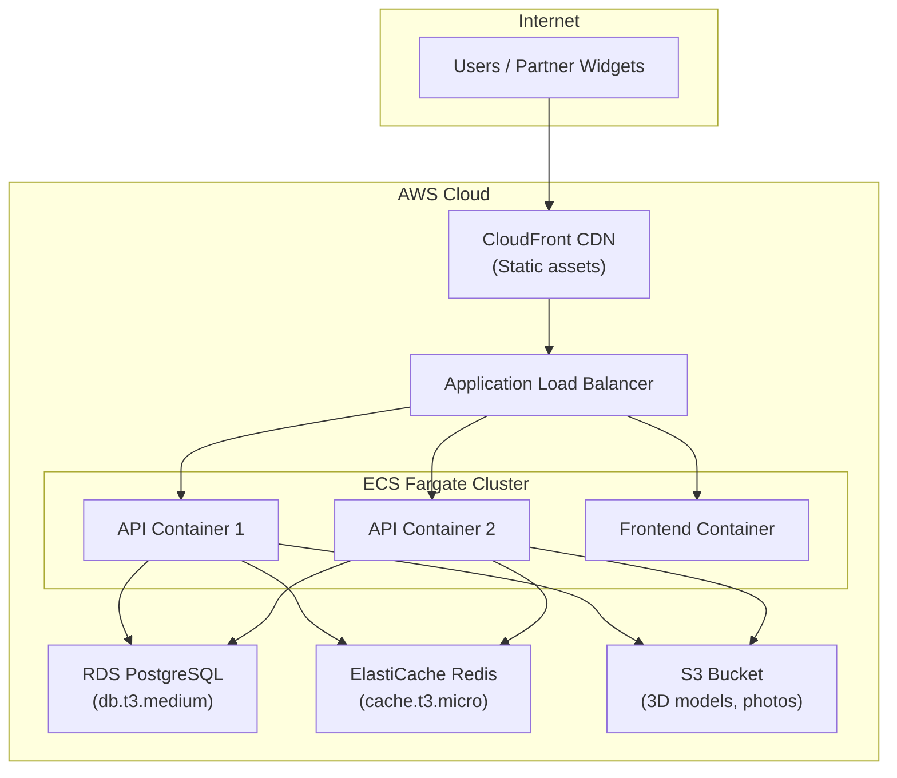
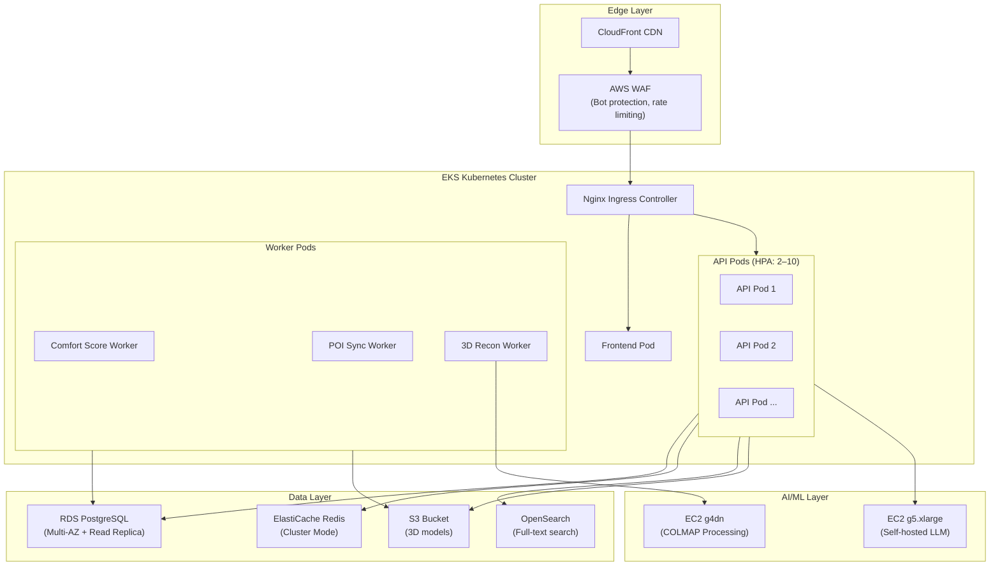

# Scaling Roadmap

## Current State: Single-Instance MVP

| Parameter | Value |
|-----------|-------|
| Infrastructure | AWS Lightsail, 1 instance |
| Specs | 4 GB RAM, 2 vCPU, 80 GB SSD |
| Monthly cost | $40 (instance) + ~$10 (API usage) = **~$50/month** |
| Estimated capacity | ~100 concurrent users, ~10,000 monthly users |
| Architecture | Docker Compose (5 containers on 1 host) |
| Database | PostgreSQL 16 + PostGIS 3.4 (containerized) |
| Cache | Redis 7 (containerized) |
| Storage | Lightsail Object Storage (250 GB included) |
| SSL | Let's Encrypt (Certbot) |
| CI/CD | GitHub Actions → SSH deploy |

---

## Tier 1: 1,000 Monthly Users (~$80–120/month)

**Trigger:** MVP pilot with 1 partner platform generates sustained traffic.

### Changes

| Component | Current | Upgraded |
|-----------|---------|----------|
| Compute | Lightsail 4 GB ($40) | Lightsail 8 GB ($80) |
| Database | Containerized PostgreSQL | Lightsail Managed Database ($15/month) |
| Architecture | Docker Compose (same) | Docker Compose (same, 1 fewer container) |
| New: Monitoring | None | UptimeRobot (free) + Docker health checks |
| New: Backups | Manual snapshots | Automated daily Lightsail snapshots |

### Rationale

- **Managed database** separates database I/O from application compute. PostgreSQL gets dedicated resources, automated backups, and point-in-time recovery.
- **8 GB instance** provides headroom for concurrent API calls and 3D model processing.
- **No architectural changes** — Docker Compose remains the orchestrator.

### Estimated Monthly Cost

| Item | Cost |
|------|------|
| Lightsail 8 GB instance | $80 |
| Lightsail Managed Database (1 GB, 1 vCPU) | $15 |
| Object Storage (250 GB) | Included |
| OpenAI API (~5,000 searches/month) | $5 |
| Google Places API (within free tier) | $0 |
| **Total** | **~$100/month** |

---

## Tier 2: 10,000 Monthly Users (~$250–400/month)

**Trigger:** 2–3 partner platforms integrated. Sustained 500+ daily active users.

### Changes

| Component | Current | Upgraded |
|-----------|---------|----------|
| Compute | Lightsail 8 GB | AWS ECS Fargate (auto-scaling) |
| Database | Lightsail Managed DB | AWS RDS PostgreSQL (db.t3.medium) |
| Cache | Containerized Redis | AWS ElastiCache Redis (cache.t3.micro) |
| CDN | None | AWS CloudFront (static assets + map tiles) |
| Load Balancer | Nginx on instance | AWS Application Load Balancer (ALB) |
| Storage | Lightsail Object Storage | AWS S3 Standard |
| Architecture | Docker Compose | ECS Fargate (task definitions) |
| Monitoring | Basic | AWS CloudWatch + Sentry (error tracking) |

### Architecture Overview

### Key Decisions

- **ECS Fargate** replaces Docker Compose: serverless containers, auto-scaling (min 1, max 4 API instances), no instance management.
- **ALB** distributes traffic across API instances and handles SSL termination.
- **CloudFront** serves static frontend assets (HTML, JS, CSS) from edge locations, reducing latency for users across Uzbekistan.
- **RDS PostgreSQL** provides automated backups, monitoring, and failover (Multi-AZ for higher tiers).
- **ElastiCache Redis** provides managed Redis with automatic failover.

### Estimated Monthly Cost

| Item | Cost |
|------|------|
| ECS Fargate (2 API tasks, 0.5 vCPU, 1 GB each) | $60 |
| ECS Fargate (1 frontend task) | $15 |
| RDS PostgreSQL (db.t3.medium, single-AZ) | $70 |
| ElastiCache Redis (cache.t3.micro) | $15 |
| ALB | $25 |
| CloudFront (50 GB/month) | $5 |
| S3 (50 GB storage) | $2 |
| NAT Gateway | $35 |
| OpenAI API (~50,000 searches) | $30 |
| Google Places API | $20 |
| **Total** | **~$277/month** |

---

## Tier 3: 100,000 Monthly Users (~$1,000–2,000/month)

**Trigger:** 5+ partner platforms. National-scale deployment across Uzbekistan. Commercial revenue from API subscriptions.

### Changes

| Component | Tier 2 | Tier 3 |
|-----------|--------|--------|
| Container Orchestration | ECS Fargate | Amazon EKS (Kubernetes) |
| API Scaling | Auto-scale 1–4 | Horizontal Pod Autoscaler (2–10 pods) |
| Database | RDS Single-AZ | RDS Multi-AZ with read replicas |
| Cache | ElastiCache micro | ElastiCache medium (cluster mode) |
| CDN | CloudFront basic | CloudFront + Lambda@Edge |
| Search | PostGIS queries | PostgreSQL + Elasticsearch (hybrid) |
| AI Processing | On-demand OpenAI | Self-hosted LLM (LLaMA 3 on GPU instance) |
| 3D Processing | Cloud API (Luma/Tripo) | Dedicated GPU instances for COLMAP |
| Monitoring | CloudWatch + Sentry | Datadog or Grafana Cloud (full observability) |
| Deployment | GitHub Actions → ECS | ArgoCD → EKS (GitOps) |
| Multi-region | No | CloudFront in Edge + potential EU region for partners |

### Architecture Overview

### Key Decisions

- **EKS (Kubernetes)** for complex orchestration: Horizontal Pod Autoscaler, rolling deployments, namespace isolation per tenant, resource limits and priorities.
- **Self-hosted LLM** (LLaMA 3 on GPU) eliminates OpenAI API dependency and reduces per-query cost from $0.001 to ~$0.0001. Amortized GPU instance cost is justified at 100K+ searches/month.
- **OpenSearch** (managed Elasticsearch) provides full-text search and geo-distance queries for fast property filtering at scale. PostgreSQL remains the primary data store; OpenSearch is used as a read-optimized search index.
- **Multi-AZ RDS** provides automatic failover for database high availability.
- **AWS WAF** protects against DDoS, bot traffic, and API abuse.

### Estimated Monthly Cost

| Item | Cost |
|------|------|
| EKS Cluster (control plane) | $73 |
| EC2 instances (3× m5.large for worker nodes) | $230 |
| EC2 GPU (g5.xlarge for LLM, spot instances) | $200 |
| EC2 GPU (g4dn.xlarge for 3D, spot, intermittent) | $80 |
| RDS PostgreSQL (db.r5.large, Multi-AZ) | $280 |
| ElastiCache Redis (cache.r5.large, cluster) | $120 |
| OpenSearch (1 node, r5.large) | $150 |
| ALB | $25 |
| CloudFront (500 GB/month) | $45 |
| S3 (500 GB storage) | $12 |
| NAT Gateway | $35 |
| CloudWatch / Monitoring | $30 |
| **Total** | **~$1,280/month** |

---

## Cost Comparison Summary

| Tier | Monthly Users | Architecture | Monthly Cost | Cost per User |
|------|--------------|-------------|-------------|---------------|
| MVP | ~1,000 | Docker Compose on Lightsail | $50 | $0.05 |
| Tier 1 | ~1,000–5,000 | Lightsail (upgraded) | $100 | $0.02–0.10 |
| Tier 2 | ~10,000 | ECS Fargate + RDS | $280 | $0.03 |
| Tier 3 | ~100,000 | EKS + GPU + Multi-AZ | $1,280 | $0.013 |

**Key insight:** Cost per user **decreases** as scale increases due to amortized fixed costs (database, cache, GPU instances). The B2B subscription model ($500–$5,000/month per partner) easily covers infrastructure costs from Tier 1 onward.

---

## Migration Checklist

### Lightsail → ECS Fargate (Tier 1 → Tier 2)

- [ ] Create ECR repositories for API and frontend Docker images
- [ ] Create ECS cluster with Fargate launch type
- [ ] Define ECS task definitions from existing Dockerfiles
- [ ] Create Application Load Balancer with target groups
- [ ] Migrate PostgreSQL data from Lightsail DB to RDS (pg_dump/pg_restore)
- [ ] Create ElastiCache Redis cluster
- [ ] Update application config for new database/redis endpoints
- [ ] Configure ECS auto-scaling policies
- [ ] Set up CloudFront distribution for frontend static assets
- [ ] Update DNS to point to ALB
- [ ] Migrate S3 data from Lightsail Object Storage to S3
- [ ] Update GitHub Actions to deploy to ECS (aws ecs update-service)
- [ ] Verify all endpoints and health checks
- [ ] Monitor for 48 hours, decommission Lightsail

### ECS Fargate → EKS (Tier 2 → Tier 3)

- [ ] Design Kubernetes manifests (Deployments, Services, Ingress, ConfigMaps, Secrets)
- [ ] Create Helm charts for PropVision services
- [ ] Set up EKS cluster with managed node groups
- [ ] Configure Horizontal Pod Autoscaler for API pods
- [ ] Deploy OpenSearch and configure data sync from PostgreSQL
- [ ] Set up GPU node group for self-hosted LLM
- [ ] Implement ArgoCD for GitOps deployment
- [ ] Migrate data from RDS (reuse existing RDS or snapshot/restore)
- [ ] Configure AWS WAF rules
- [ ] Set up Datadog/Grafana monitoring
- [ ] Load test at 10× expected traffic
- [ ] Blue-green cutover from ECS to EKS
